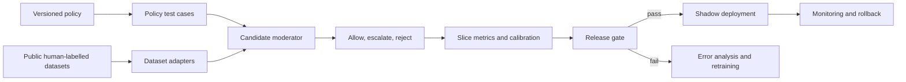

# System architecture

The benchmark separates policy conformance from external domain-shift tests.
Civil Comments measures toxicity under one label policy; ToxicChat and
BeaverTails test how the frozen candidate behaves on different human-labelled
distributions. None of them is silently treated as an exact replacement for the
project's own policy labels.

The service path uses explicit thresholds, escalation, versioned artifacts,
monitoring, and rollback. Release remains blocked when false acceptance or
human-review requirements fail.
